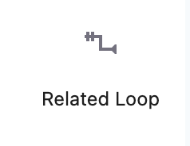

## Variation block Loop Query for display post related by category

This block is a variation of the block Loop Query. It allows to display posts related by category.

You can find the block "Related Loop" in "THEME" section in the inserter of Gutenberg editor.

This variation work with all your post type or custom post type. You choose the taxonomy name for find related elements.

## Links page WP developer resources

- [https://developer.wordpress.org/block-editor/how-to-guides/block-tutorial/extending-the-query-loop-block/](https://developer.wordpress.org/block-editor/how-to-guides/block-tutorial/extending-the-query-loop-block/)
